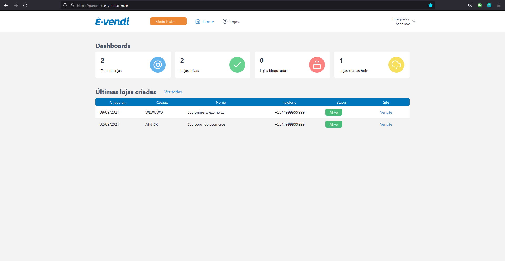
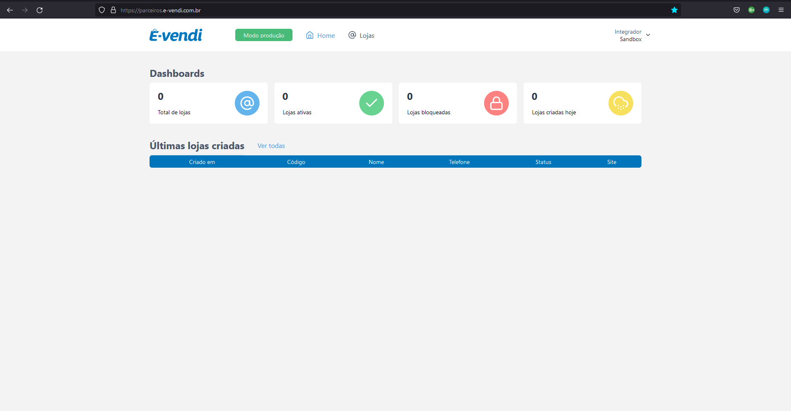

## E-vendi - Crie seu e-commerce através de nossa API

E-COMMERCE E SACOLINHA DO INSTAGRAM: TUDO QUE SUA LOJA PRECISA PARA VENDER MAIS.

---

## Boas Vindas!

Estamos muito feliz em você considerar ser nosso parceiro integrador, queremos muito ser benção em seus negócios e esperamos que você prospere muito, e óbvio, esperamos poder te ajudar nesta empreitada, por isso agora nossa parceria fica ainda mais forte. Estaremos aqui prontos para te ajudar e crecermos juntos, então conte com a gente!

---

## Primeiro Passo

### Como se tornar um integrador?

Para poder dar continuidade em nossos serviços e criar sua conta, é necessário preencher nosso formulário de intenção de integrador, e aguardar nossa resposta, assim te adicionaremos em nosso sistema e começar a trabalhar juntos.

#### Segue o link

[Nosso Formulário](https://docs.google.com/forms/d/e/1FAIpQLScbMScC54Eb3YdIYpqqK3K-V1NG8yydKT4f1iOejmJbDTj_ow/viewform 'Formulário para a integração')

---

## Segundo Passo

### Acessando painel integrador

Agora que nossa equipe entrou em contato, você já tem um usuário e senha para acessar o nosso site de parceiros.

#### Segue o link

[Site de Parceiros](https://parceiros.e-vendi.com.br/auth/sign-in 'Página de Login')

Basta colocar suas credenciais e logar na sua conta!

---

## Terceiro Passo

### Modo de desenvolvedor

Esse modo é um sendbox livre para você aprender a mexer com o nosso sistema, nesse modo transações não serão cobradas.

---

## Quarto Passo

### Modo de produção

Nesse modo a sua loja é real, aqui as transações serão debidatas e creditadas.

---

## Finalização

Agora que a sua conta já foi criada, você pode seguir com o nosso tutorial de como criar e configurar a sua loja!

---

## Exemplo de código

<iframe src="//api.apiembed.com/?source=https://raw.githubusercontent.com/e-vendi/e-vendi-docs/main/json-examples/example.json&targets=all" frameborder="0" scrolling="no" width="100%" height="500px" seamless></iframe>
